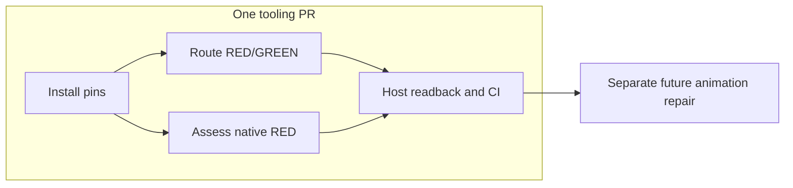

# Dependencies

```mermaid
graph LR
  subgraph batch[One tooling PR]
    T1[Install pins] --> T2[Route RED/GREEN]
    T1 --> T3[Assess native RED]
    T2 --> V[Host readback and CI]
    T3 --> V
  end
  V --> R[Separate future animation repair]
```
